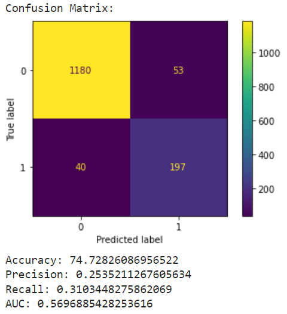

# Predicting Employee Attrition Using Decision Trees and Random Forests
Employees leave companies and organizations every day for different reasons such as being fired, retiring, or resigning. If a company is looking to hire and retain more employees, how can they improve the strategies they use to do so?

## Business Understanding
**Employees** are the heart of any company or organization - without employees, work doesn't get done and money doesn't get made. If an organization's **upper leadership and/or human resources staff** can determine why an employee may leave, they can use this information to **create more effective hiring and retention practices.** 

## Data Understanding
The data used in this project was retrieved from [Kaggle](https://www.kaggle.com/datasets/pavansubhasht/ibm-hr-analytics-attrition-dataset) but was originally collected by IBM's human resources department.

This data is in the form of a survey given to employees. The features are relatively self-explanatory, but there isn't much information regarding where this data was collected from other than what was previously mentioned.

The features in this analysis be later used to train predictive models to determine whether an employee will leave a company. After tuning and other improvements, this could be useful for upper leadership and/or human resources staff to identify changes that need to be made to more effectively hire or retain employees.

Although there were no missing values in this dataset, it is a small dataset relative to what is generally used to effectively train a machine learning model. This limitation of data means that there is a limitation to how well the machine learning models trained on the data perform. Additionally, some values such as Gender, JobRole, and MaritalStatus needed to be encoded for the machine learning model to use in its predictions.

Another limitation of this data is that there is a class imbalance - there is a much higher number of employees who stayed at IBM than left in this dataset. This class imbalance was addressed by resampling the data using SMOTE (Synthetic Minority Oversampling TEchnique).

## Model(s) and Evaluation
First, an untuned decision tree model was used to get a baseline for later models' performance. As expected, this first model's accuracy, precision, recall and Area Under the ROC Curve (AUC) scores were low relative to what is desired for a machine learning model.  

To improve model performance, SMOTE was used to resample the dataset so there was an equal number of employees who stayed at IBM and left IBM. This was done because the previous model was excelling at identifying an employee that would stay at the company, but was not good at identifying those who left. This second model had a lower accuracy, but higher precision, recall, and AUC scores, meaning it was getting better at identifying true positives and true negatives.  

Finally, a random forest model was trained with the resampled data to try and further improve performance. Because a random forest model is a collection of decision trees working together to classify things more accurately, this will be used as the final iteration of the model we'll use to try and predict employee attrition.

Our final model had better metrics than both the models before, but it still is not up to the standard of a machine learning model that would be used to make real-world decisions that affect businesses and employees.  

## Conclusion
Based off the performance of our final model, this method as it is now cannot be used to predict employee attrition. This final model above using random forests has overall better scores than both our baseline and resampled models, but is still not accurate or precise enough to be used when making real-world decisions. Overhauling both hiring and retention techniques costs time and money - time and money that might be wasted if the above model predicts either false positives or false negatives.

This is a good starting point for upper leadership and/or human resources staff at any organization to evaluate whether they are effectively hiring and retaining their employees. However, results can further improve by collecting better data, further tuning models, and using more rigorous technologies such as neural networks to predict employee attrition. 

## Repository Navigation
Take a look at this README to get a gist of the dataset, problem, and stakeholders.  
Navigate to the [Jupyter Notebook](./Code/"Predicting Employee Attrition Using Decision Trees and Random Forests.ipynb") to see code and an in-depth description of how the problem could be solved.  
**3.)** Take a look at the [final presentation](./"AI Academy Final Presentation.pptx").  

## Sources
[Dataset](https://www.kaggle.com/datasets/pavansubhasht/ibm-hr-analytics-attrition-dataset)  
[Learning about SMOTE](https://machinelearningmastery.com/smote-oversampling-for-imbalanced-classification/)  
[Understanding Random Forests](https://towardsdatascience.com/understanding-random-forest-58381e0602d2)  
[Using a Random Forest Model](https://towardsdatascience.com/random-forest-in-python-24d0893d51c0)
